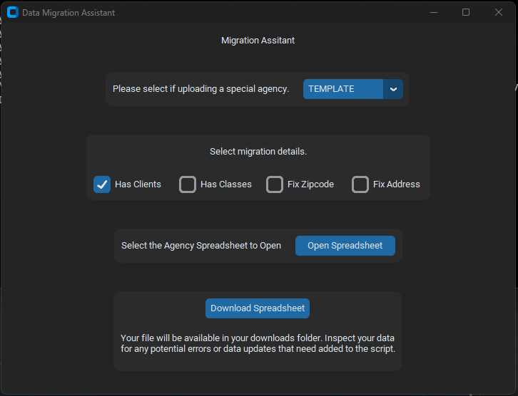

# Migration Assistant

Migration Assistant is an application built to assist in cleaning excel files from agencies in preparation for data migration into our system.



## Getting Started

Python 3 will be required to be installed on your system, and knowledge to preferable create a virtual environment.

To get started with Migration Assistant, you'll need to install the tool on your machine. 
You can do this by cloning the repository and installing the dependencies:

```
$ git clone https://github.com/raythurman2386/Migration-Assistant.git
$ cd Migration-Assistant
$ pip install -r requirements.txt
```

Once you have the dependencies installed you may run the application.

```
$ python src/main.py
```

This will open the custom tkinter window of the application. This is very specific to our template, if you would like a demo please reach out.