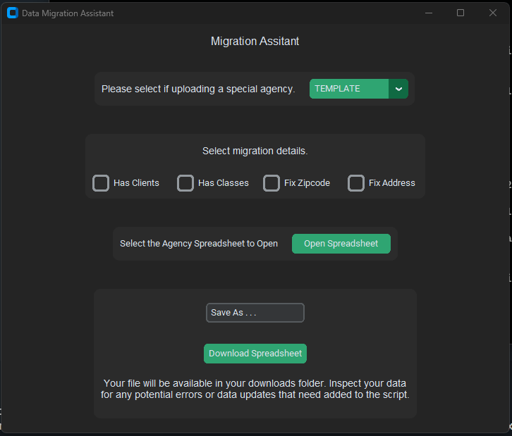

# Migration Assistant



This application is designed to clean and normalize data in an Excel file to match a specific template. The user can upload an Excel file, the application will then clean and normalize the data, and finally the user can download the cleaned and normalized data in the specified template format. Designed as tooling to assist with agency data migrations from one cms to another.

## Key Features:

Upload Excel file: User can upload an Excel file with their data.
Data Cleaning: The application will perform data cleaning operations to remove any missing or inconsistent data.

Data Normalization: The application will normalize the data to match a specific template format.
Download Cleaned and Normalized Data: The user can download the cleaned and normalized data in the specified template format.

## Technologies Used:

Python

Openpyxl library for data manipulation and analysis(pandas future implementation being looked into)

Tkinter and Custom Tkinter for GUI development

## Benefits:

Easy to use: The user can easily upload their Excel file, the application will clean and normalize the data and the user can download the result with just a few clicks.

Consistent Data Format: The application will normalize the data to a consistent format, making it easier for further analysis and processing.

Improved Data Quality: By cleaning and normalizing the data, the quality of the data will be improved, leading to better results from any analysis or processing performed on the data.

## Getting Started

Python 3 will be required to be installed on your system, and knowledge to preferable create a virtual environment.

To get started with Migration Assistant, you'll need to install the tool on your machine.
You can do this by cloning the repository and installing the dependencies:

```
$ git clone https://github.com/raythurman2386/Migration-Assistant.git
$ cd Migration-Assistant
$ pip install -r requirements.txt
```

Once you have the dependencies installed you may run the application.

```
$ python src/main.py
```

## Conclusion:

This application is designed to make the process of cleaning and normalizing Excel data easy and efficient. With its user-friendly interface and powerful data processing capabilities, it is a valuable tool for anyone working with large data sets in Excel format.

This will open the custom tkinter window of the application. This is very specific to our template, if you would like a demo please reach out.
